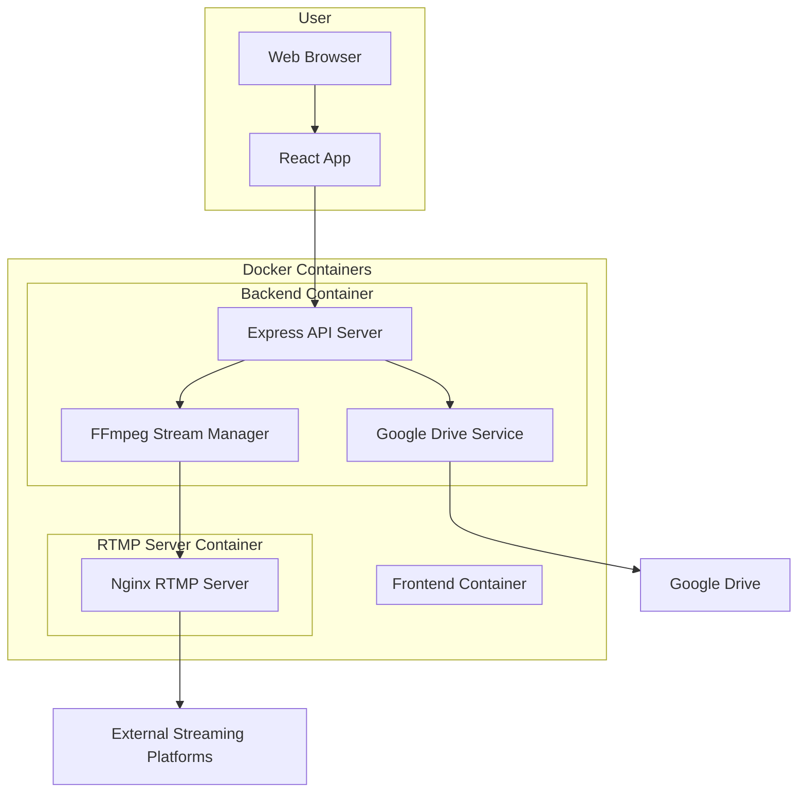

# Local to RTMP Pusher

A web-based media streaming system that allows you to stream video files from local storage or Google Drive to RTMP/SRT endpoints using FFmpeg.

## Features

- 📹 Stream local video files to RTMP/SRT endpoints
- 🌐 Stream from Google Drive shared folders
- 🎛️ Configurable video/audio codecs and quality settings
- 🖥️ Web-based user interface
- 🐳 Fully containerized with Docker
- 📊 Real-time stream status monitoring
- 🚀 Built-in RTMP server for testing

## Architecture



## Prerequisites

- Docker and Docker Compose
- Node.js 18+ (for development)
- FFmpeg (included in containers)

## Quick Start

1. Clone the repository:
```bash
git clone https://github.com/azumag/local-to-rtmp-pusher.git
cd local-to-rtmp-pusher
```

2. Start the application:
```bash
docker-compose up -d
```

3. Access the web interface:
- Frontend: http://localhost:3000
- RTMP Server: rtmp://localhost:1935/live

## Development Setup

### Using VS Code Dev Container (Recommended)

1. Install the [Remote - Containers](https://marketplace.visualstudio.com/items?itemName=ms-vscode-remote.remote-containers) extension
2. Open the project in VS Code
3. Click "Reopen in Container" when prompted
4. The development environment will be automatically configured

### Manual Setup

1. Install dependencies:
```bash
# Backend
cd backend
npm install

# Frontend
cd ../frontend
npm install
```

2. Start development servers:
```bash
# Backend (from backend directory)
npm run dev

# Frontend (from frontend directory)
npm start
```

## Configuration

### Environment Variables

Create a `.env` file in the backend directory:

```env
NODE_ENV=development
PORT=5000
GOOGLE_CLIENT_ID=your_google_client_id
GOOGLE_CLIENT_SECRET=your_google_client_secret
```

### Stream Settings

Default stream settings can be configured in the web interface:
- Video Codec: libx264, libx265, copy
- Audio Codec: aac, mp3, copy
- Video Bitrate: 1000k - 8000k
- Audio Bitrate: 128k - 320k
- Resolution: Original, 1920x1080, 1280x720, 854x480

## API Documentation

### Endpoints

#### Files
- `GET /api/files` - List uploaded files
- `POST /api/files/upload` - Upload a new file
- `DELETE /api/files/:id` - Delete a file

#### Google Drive
- `POST /api/google-drive/list` - List files from a shared folder
- `POST /api/google-drive/download` - Download a file from Google Drive

#### Streams
- `GET /api/streams` - List active streams
- `POST /api/streams/start` - Start a new stream
- `POST /api/streams/stop/:id` - Stop a stream
- `GET /api/streams/status/:id` - Get stream status

## Project Structure

```
/
├── backend/                  # Express.js API server
│   ├── src/
│   │   ├── routes/          # API endpoints
│   │   ├── services/        # Business logic
│   │   └── utils/           # Utility functions
│   └── Dockerfile
│
├── frontend/                # React application
│   ├── src/
│   │   ├── pages/          # Page components
│   │   ├── services/       # API client services
│   │   └── App.js
│   └── Dockerfile
│
├── rtmp-server/            # Nginx RTMP server
│   ├── config/
│   └── Dockerfile
│
├── .devcontainer/          # VS Code Dev Container config
└── docker-compose.yml      # Docker Compose configuration
```

## Testing

### Running Tests

```bash
# Backend tests
cd backend
npm test

# Frontend tests
cd frontend
npm test
```

### Test Coverage

```bash
# Generate coverage report
npm run test:coverage
```

## CI/CD

This project uses GitHub Actions for continuous integration and deployment:

- **Test Pipeline**: Runs on every push and pull request
- **Build Pipeline**: Builds Docker images on main branch
- **Deploy Pipeline**: Deploys to production on release tags

## Contributing

1. Fork the repository
2. Create a feature branch (`git checkout -b feature/amazing-feature`)
3. Commit your changes (`git commit -m 'Add amazing feature'`)
4. Push to the branch (`git push origin feature/amazing-feature`)
5. Open a Pull Request

### Code Style

- Follow ESLint configuration
- Use Prettier for code formatting
- Write meaningful commit messages
- Add tests for new features

## Troubleshooting

### Common Issues

1. **Port already in use**
   ```bash
   # Change ports in docker-compose.yml or stop conflicting services
   docker-compose down
   docker-compose up -d
   ```

2. **FFmpeg not found**
   ```bash
   # Rebuild containers
   docker-compose build --no-cache
   ```

3. **Google Drive authentication fails**
   - Ensure correct OAuth credentials in `.env`
   - Check if the shared folder URL is valid

### Logs

View container logs:
```bash
# All containers
docker-compose logs -f

# Specific container
docker-compose logs -f backend
```

## Security Considerations

- No authentication is required by design
- Ensure proper network isolation in production
- Validate all input data
- Use environment variables for sensitive configuration
- Regular security updates for dependencies

## License

This project is licensed under the MIT License - see the [LICENSE](LICENSE) file for details.

## Acknowledgments

- [FFmpeg](https://ffmpeg.org/) for media processing
- [nginx-rtmp-module](https://github.com/arut/nginx-rtmp-module) for RTMP server
- [React](https://reactjs.org/) and [Express.js](https://expressjs.com/) for web framework