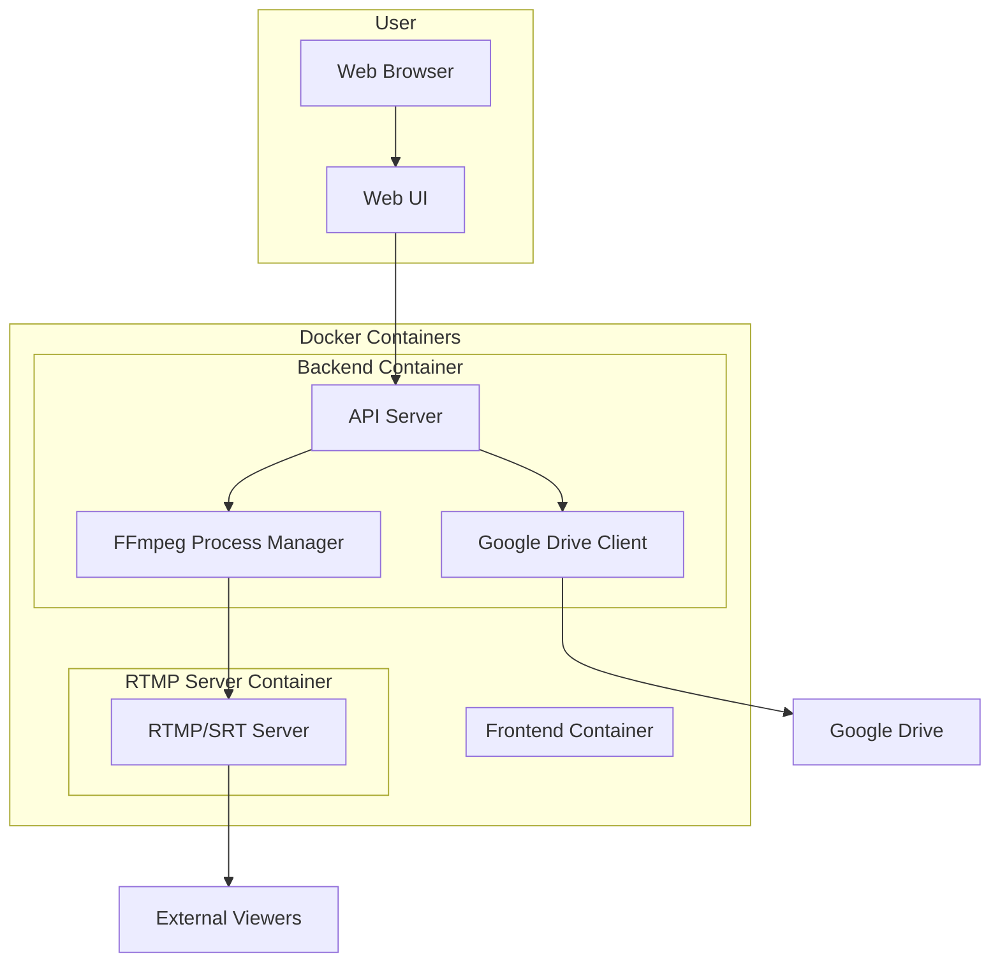
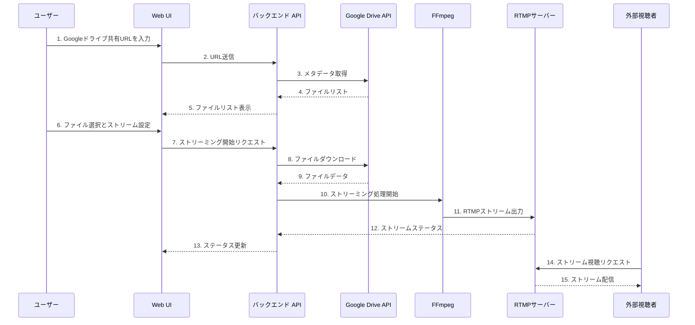

# ローカル/Googleドライブからのメディアストリーミングシステム設計

## システム要件まとめ

- **目的**: ローカルまたはGoogleドライブの動画ファイルをRTMP/SRTでストリーミング配信
- **技術要件**:
  - FFmpegを使用したメディア処理
  - Dockerコンテナベースの実装
  - docker-composeによる構成管理
- **機能要件**:
  - WebベースのUI
  - 共有Googleドライブフォルダへのアクセス
  - RTMPまたはSRTプロトコルでのプッシュ
  - 自前のRTMPサーバーを含む
  - 簡易なストリーム設定機能
  - ユーザー認証不要

## システムアーキテクチャ



## コンポーネント詳細

### 1. フロントエンドコンテナ
- **技術**: React/Vue.js, Bootstrap/Material-UI
- **機能**:
  - Googleドライブ共有URL入力フォーム
  - ファイルブラウザとセレクター
  - 簡易ストリーム設定パネル（ビットレート、解像度等）
  - ストリーム制御インターフェース（開始/停止）
  - ストリームステータス表示

### 2. バックエンドコンテナ
- **技術**: Node.js/Express または Python/FastAPI
- **機能**:
  - RESTful API
  - Googleドライブアクセス処理
  - FFmpegプロセス管理
  - ファイル管理（ダウンロード/キャッシュ）
  - ストリーム設定処理

### 3. RTMPサーバーコンテナ
- **技術**: Nginx-RTMP モジュールまたは SRS (Simple RTMP Server)
- **機能**:
  - RTMP/SRTプロトコルサポート
  - ストリーム配信
  - 外部クライアントからのpullサポート

## データフロー



## Docker構成

```yaml
version: '3'

services:
  frontend:
    build: ./frontend
    ports:
      - "80:80"
    depends_on:
      - backend
    networks:
      - app-network

  backend:
    build: ./backend
    environment:
      - NODE_ENV=production
    volumes:
      - media-cache:/app/cache
    depends_on:
      - rtmp-server
    networks:
      - app-network

  rtmp-server:
    build: ./rtmp-server
    ports:
      - "1935:1935"  # RTMP
      - "8080:8080"  # HTTP (HLS)
    volumes:
      - rtmp-data:/var/lib/rtmp
    networks:
      - app-network

networks:
  app-network:

volumes:
  media-cache:
  rtmp-data:
```

## ディレクトリ構造案

```
/
├── frontend/                 # フロントエンドアプリケーション
│   ├── Dockerfile
│   ├── public/
│   ├── src/
│   │   ├── components/       # UI コンポーネント
│   │   ├── services/         # API 接続サービス
│   │   └── ...
│   └── package.json
│
├── backend/                  # バックエンドAPI
│   ├── Dockerfile
│   ├── src/
│   │   ├── controllers/      # APIエンドポイント
│   │   ├── services/         # ビジネスロジック
│   │   ├── utils/            # ユーティリティ関数
│   │   └── ...
│   └── package.json
│
├── rtmp-server/              # RTMPサーバー
│   ├── Dockerfile
│   ├── config/               # サーバー設定
│   └── ...
│
└── docker-compose.yml        # Docker Compose 設定
```

## 技術選定

1. **フロントエンド**:
   - React.js (または Vue.js)
   - Axios (HTTP クライアント)
   - React Bootstrap (UI フレームワーク)

2. **バックエンド**:
   - Node.js + Express.js
   - googleapis (Google Drive API クライアント)
   - fluent-ffmpeg (FFmpeg Node.js ラッパー)

3. **RTMPサーバー**:
   - nginx-rtmp-module (nginx + RTMP モジュール)
   - または SRS (Simple RTMP Server)

4. **コンテナ化**:
   - Docker
   - docker-compose

## 実装計画

1. **フェーズ1**: 基本設定
   - プロジェクト構造の設定
   - Docker環境の構築
   - RTMPサーバーの設定と検証

2. **フェーズ2**: バックエンド開発
   - FFmpeg統合
   - ファイル管理システム
   - APIエンドポイント実装

3. **フェーズ3**: Googleドライブ統合
   - Google Drive APIクライアント実装
   - ファイルメタデータ取得
   - ファイルダウンロード処理

4. **フェーズ4**: フロントエンド開発
   - UI設計と実装
   - APIとの連携
   - ストリーム制御インターフェース

5. **フェーズ5**: 統合とテスト
   - コンポーネント間の統合
   - エンドツーエンドテスト
   - パフォーマンス最適化