# StreamCaster

A professional web-based media streaming platform that allows you to stream video files from local storage or Google Drive to RTMP/SRT endpoints using FFmpeg.

## Features

- 📹 Stream local video files to RTMP/SRT endpoints
- 🌐 Stream from Google Drive shared folders
- 🎛️ Configurable video/audio codecs and quality settings
- 🖥️ Modern responsive web interface with horizontal navigation
- 🐳 Fully containerized with Docker
- 📊 Real-time stream status monitoring
- 🚀 Built-in RTMP server for testing
- 🔥 Hot-reloading development environment

## Architecture


## Prerequisites

- Docker and Docker Compose
- Node.js 18+ (for development)
- FFmpeg (included in containers)

## Quick Start

1. Clone the repository:

```bash
git clone https://github.com/azumag/streamcaster.git
cd streamcaster
```

2. Start the application:

```bash
docker-compose up -d
```

3. Access the web interface:

- Frontend: http://localhost:8080
- Backend API: http://localhost:3001
- RTMP Server: rtmp://localhost:1935/live

## Development Setup

### Quick Development Start (Recommended)

The easiest way to start developing is using the included development environment with hot-reloading:

```bash
# Start development environment with hot-reloading
make dev

# Or manually:
docker-compose -f docker-compose.dev.yml up -d
```

This will start:

- Frontend with hot-reloading: http://localhost:8080
- Backend API: http://localhost:3001
- RTMP Server: rtmp://localhost:1935/live

### Available Make Commands

```bash
make dev          # Start development environment
make dev-build    # Build development containers
make prod         # Start production environment
make down         # Stop all containers
make logs         # View all container logs
make restart      # Restart all containers
```

### Manual Development Setup

For local development without Docker:

1. Install dependencies:

```bash
# Backend
cd backend && npm install

# Frontend
cd frontend && npm install
```

2. Start development servers:

```bash
# Backend (from backend directory)
npm run dev

# Frontend (from frontend directory)
npm start
```

## Configuration

### Environment Variables

Environment variables are automatically configured for development and production:

**Development** (`frontend/.env.development`):

```env
REACT_APP_API_URL=http://localhost:3001
GENERATE_SOURCEMAP=true
CHOKIDAR_USEPOLLING=true
```

**Production** (`frontend/.env.production`):

```env
REACT_APP_API_URL=/api
GENERATE_SOURCEMAP=false
```

**Backend** (create `.env` in backend directory):

```env
NODE_ENV=development
PORT=3000
GOOGLE_CLIENT_ID=your_google_client_id
GOOGLE_CLIENT_SECRET=your_google_client_secret
```

### Stream Settings

Default stream settings can be configured in the web interface:

- Video Codec: libx264, libx265, copy
- Audio Codec: aac, mp3, copy
- Video Bitrate: 1000k - 8000k
- Audio Bitrate: 128k - 320k
- Resolution: Original, 1920x1080, 1280x720, 854x480

## API Documentation

### Endpoints

#### Files

- `GET /api/files` - List uploaded files
- `POST /api/files/upload` - Upload a new file
- `DELETE /api/files/:id` - Delete a file

#### Google Drive

- `POST /api/google-drive/list` - List files from a shared folder
- `POST /api/google-drive/download` - Download a file from Google Drive

#### Streams

- `GET /api/streams` - List active streams
- `POST /api/streams/start` - Start a new stream
- `POST /api/streams/stop/:id` - Stop a stream
- `GET /api/streams/status/:id` - Get stream status

## Project Structure

```
/
├── backend/                    # Express.js API server
│   ├── src/
│   │   ├── routes/            # API endpoints
│   │   ├── services/          # Business logic
│   │   └── utils/             # Utility functions
│   └── Dockerfile
│
├── frontend/                  # React application
│   ├── src/
│   │   ├── pages/            # Page components
│   │   ├── services/         # API client services
│   │   ├── components/       # UI components
│   │   └── App.js
│   ├── Dockerfile            # Production build
│   ├── Dockerfile.dev        # Development with hot-reload
│   ├── .env.development      # Development environment
│   └── .env.production       # Production environment
│
├── rtmp-server/              # Nginx RTMP server
│   ├── config/
│   └── Dockerfile
│
├── docs/                     # Documentation
│   ├── development-setup.md  # Development guide
│   └── planning/             # Design documents
│
├── scripts/                  # Utility scripts
├── Makefile                  # Development commands
├── docker-compose.yml        # Production configuration
└── docker-compose.dev.yml    # Development configuration
```

## Testing

### Running Tests

```bash
# Run all tests (backend + frontend)
make test

# Backend tests only
cd backend && npm test

# Frontend tests only
cd frontend && npm test

# With coverage
npm run test:coverage
```

### Linting and Formatting

```bash
# Run linter
make lint

# Fix linting issues
make lint-fix

# Format code
make format
```

## CI/CD

This project uses GitHub Actions for continuous integration and deployment:

- **Test Pipeline**: Runs on every push and pull request
- **Build Pipeline**: Builds Docker images on main branch
- **Deploy Pipeline**: Deploys to production on release tags

## Contributing

1. Fork the repository
2. Create a feature branch (`git checkout -b feature/amazing-feature`)
3. Commit your changes (`git commit -m 'Add amazing feature'`)
4. Push to the branch (`git push origin feature/amazing-feature`)
5. Open a Pull Request

### Code Style

- Follow ESLint configuration
- Use Prettier for code formatting
- Write meaningful commit messages
- Add tests for new features

## Troubleshooting

### Common Issues

1. **Port already in use**

   ```bash
   # Stop containers and restart
   make down
   make dev  # or make prod
   ```

2. **Hot reloading not working in development**

   ```bash
   # Restart development environment
   make restart-frontend
   # or rebuild completely
   make dev-build && make dev
   ```

3. **White screen in browser**

   ```bash
   # Check container logs
   make logs-frontend
   # Restart frontend container
   docker-compose -f docker-compose.dev.yml restart streamcaster-frontend-dev
   ```

4. **API calls failing**

   - Check that backend is running on correct port (3001)
   - Verify environment variables are loaded correctly
   - Check container logs: `make logs-backend`

5. **Google Drive authentication fails**
   - Ensure correct OAuth credentials in `.env`
   - Check if the shared folder URL is valid

### Logs

View container logs:

```bash
# All containers
make logs

# Specific container
make logs-frontend  # or logs-backend, logs-rtmp
docker logs streamcaster-frontend-dev -f  # Development
docker logs streamcaster-backend -f       # Backend
```

### Development vs Production

| Feature            | Development             | Production   |
| ------------------ | ----------------------- | ------------ |
| Frontend Server    | React Dev Server (8080) | Nginx (8080) |
| Hot Reloading      | ✅ Enabled              | ❌ Disabled  |
| Source Maps        | ✅ Enabled              | ❌ Disabled  |
| Build Optimization | ❌ Disabled             | ✅ Enabled   |
| Debug Info         | ✅ Visible              | ❌ Hidden    |
| File Watching      | ✅ Polling              | N/A          |

## Security Considerations

- No authentication is required by design
- Ensure proper network isolation in production
- Validate all input data
- Use environment variables for sensitive configuration
- Regular security updates for dependencies

## License

This project is licensed under the MIT License - see the [LICENSE](LICENSE) file for details.

## Acknowledgments

- [FFmpeg](https://ffmpeg.org/) for media processing
- [nginx-rtmp-module](https://github.com/arut/nginx-rtmp-module) for RTMP server
- [React](https://reactjs.org/) and [Express.js](https://expressjs.com/) for web framework

## 配信プロセスフローチャート

```mermaid
flowchart TD
    A[セッション開始] --> B[初期入力の決定]
    B --> C{静止画？}
    C -->|Yes| D[静止画をループ動画に変換]
    C -->|No| E[動画ファイルをそのまま使用]
    D --> F[プレイリストファイル作成]
    E --> F
    F --> G[FFmpegプロセス起動]

    G --> H[プレイリストベースストリーミング開始]
    H --> I[RTMPエンドポイントへ配信]

    J[ファイル切り替えリクエスト] --> K{新しい入力は静止画？}
    K -->|Yes| L[静止画をループ動画に変換]
    K -->|No| M[動画ファイルをそのまま使用]
    L --> N[プレイリストファイル更新]
    M --> N
    N --> O[FFmpegが自動的に新しいコンテンツを読み込み]
    O --> I

    P[静止画に戻るリクエスト] --> Q[スタンバイ画像をループ動画に変換]
    Q --> N

    R[ファイル配信終了検知] --> S[自動的に静止画に切り替え]
    S --> Q

    I --> T{エラー発生？}
    T -->|Yes| U{ファイル配信中？}
    U -->|Yes| V[静止画に自動切り替え]
    U -->|No| W[再接続試行]
    V --> Q
    W --> H

    X[セッション終了] --> Y[FFmpegプロセス停止]
    Y --> Z[リソースクリーンアップ]
```


